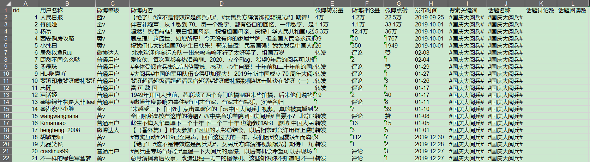
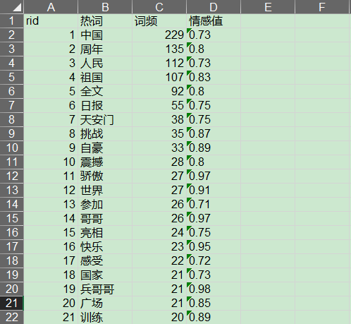
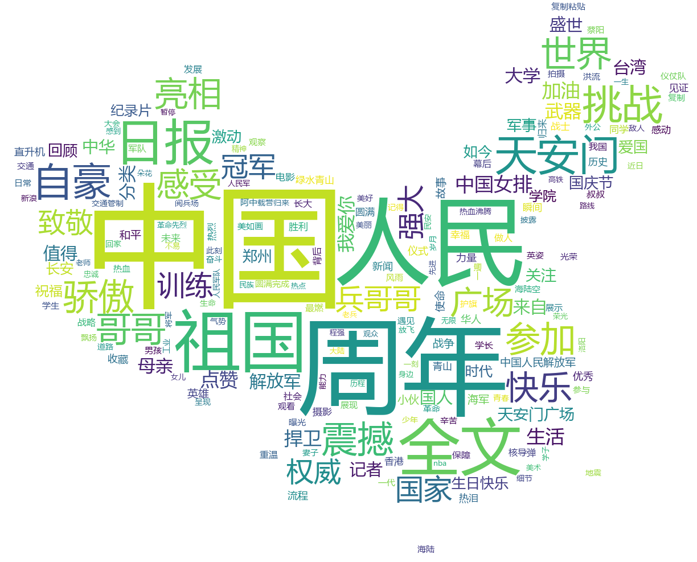

# weibo-topic-spider

微博话题简单分析

## 效果
- selenium爬取#某微博话题#下的微博内容，然后jieba分词

- 通过snownlp得到所有词的情感值，然后过滤得到#某微博话题#的正向高频词汇结果

- 最后wordcloud对这些正向高频词汇生成词云，得到#某微博话题#的热点词云图

## 参考

- [https://github.com/czy1999/weibo-topic-spider](https://github.com/czy1999/weibo-topic-spider)
- [https://github.com/gaussic/weibo_wordcloud](https://github.com/gaussic/weibo_wordcloud)

